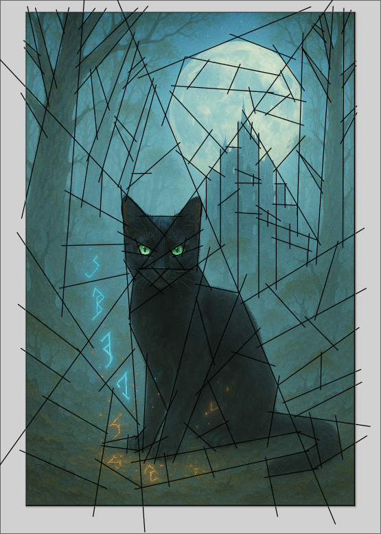
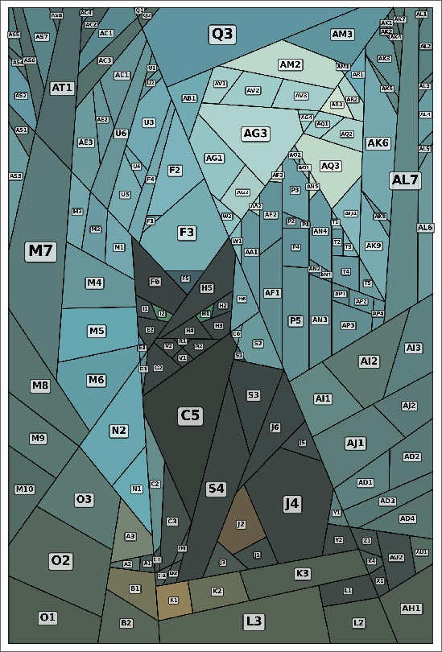
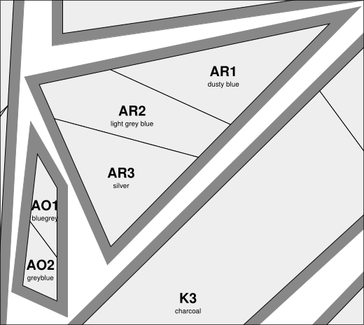
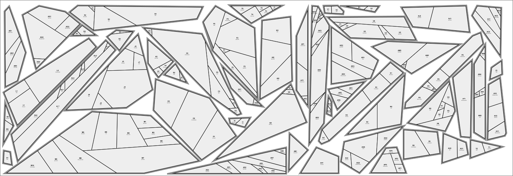
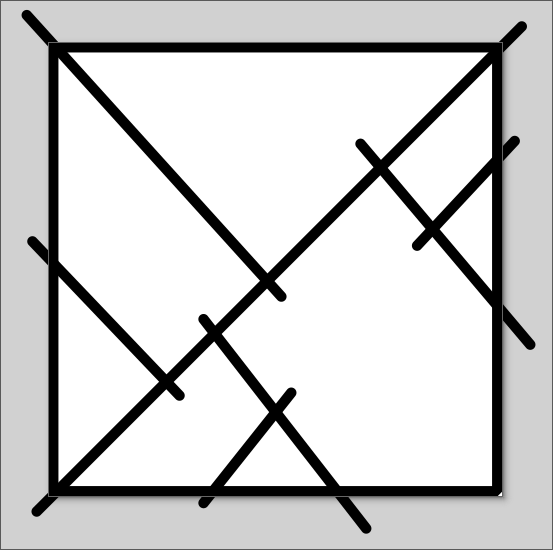
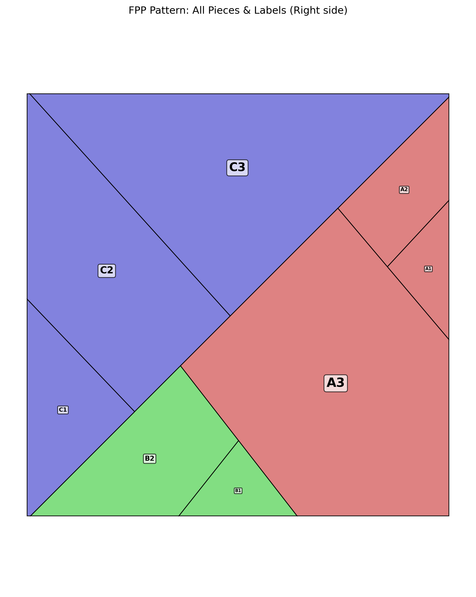
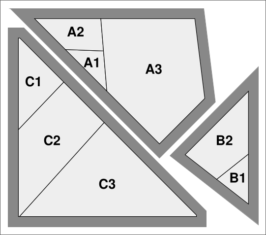
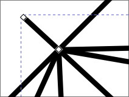

# FPP SVG to PDF/PNG Pattern Generator

A Python toolkit for turning SVG line drawings into **Foundation Paper Piecing (FPP)** quilt patterns—automatically grouping, labeling, and laying out your quilt pieces for easy printing.

<p>

</p>

<p></p>

---

## Features

- **SVG → FPP:** Converts SVG paths to precise printable quilt pieces.
- **Automatic Grouping:** Detects groups and shared edges for accurate piecing.
- **Seam Allowance:** Adds customizable seam allowances to each group.
- **Flexible Layout:** Efficiently arranges groups onto printable PDF pages.
- **Visualization:** Outputs a labeled PNG layout preview for quick checks.
- **Automatic Colors:** If your svg contains a bitmap image, automatically detects colors and uses them for each piece.
- **Easy Labeling:** Groups and pieces are automatically labeled and placed.
- **Automatic Flipping:** Printed pieces are automatically flipped, so you're working with the wrong side of the fabric.

---

## Quick-Start Example

### Draw on your SVG file
<p></p>

You can use [3groupA.svg](tests/e2e/fixtures/3groupA.svg) to get started.

### Run the script

`python main.py tests/e2e/fixtures/3groupA.svg`

### FPP groups and sew order are automatically calculated

`open out/layout.png`

<p></p>

### Pattern pieces are automatically generated and placed on your page

`open out/pieces.pdf`

<p></p>

Note that the pieces are flipped versions of the layout (i.e, they're the wrong side of the fabric).


---

## Requirements

- Python 3.8+
- Install dependencies:

`pip install -r requirements.txt`

(See below for main libraries.)

---

## Usage

```bash
usage: main.py [-h] [--pdf PDF_FILE] [--png PNG_FILE]
               [--page-width PAGE_WIDTH_IN] [--page-height PAGE_HEIGHT_IN]
               [--seam-allowance SEAM_ALLOWANCE_IN] [--margin MARGIN_IN] [-v]
               svg_file

FPP SVG to PDF/PNG pattern generator

positional arguments:
  svg_file              Input SVG file

options:
  -h, --help            show this help message and exit
  --pdf PDF_FILE        Output PDF file (default: out/pieces.pdf)
  --png PNG_FILE        Output PNG layout file (default: out/layout.png)
  --page-width PAGE_WIDTH_IN
                        PDF page width in inches (default: 8.5)
  --page-height PAGE_HEIGHT_IN
                        PDF page height in inches (default: 11.0)
  --seam-allowance SEAM_ALLOWANCE_IN
                        Seam allowance in inches (default: 0.25)
  --margin MARGIN_IN    Page margin in inches (default: 0.5)
  -v, --verbose         Enable verbose (INFO level) logging (default: False)
```

Run `python main.py --help` for full usage details.

### Output

    PDF: Pages with all grouped, labeled quilt pieces + seam allowance. If there's a bitmap image in the svg, adds color names to the pieces.

    PNG: Visual layout of all pieces and groups for quick verification. If there's a bitmap image in the svg, colors the pieces.

### Testing Install

The software installation can be tested with `pytest`. This includes unit tests and several end-to-end tests on example svgs.

---

## Main Dependencies

    shapely — for geometry handling

    svgpathtools — for SVG parsing

    matplotlib — for layout/preview visualization

    reportlab — for PDF output

    pyclipper - for packing/packing algorithm

---

## SVG Guidelines

* Use simple SVGs: all lines must be straight paths; no rects, no shapes, no curves.

* Each "patch" must be a closed shape made of lines or polylines.

* All paths must be in the same SVG file.

* Use Inkscape or similar to prepare SVGs.

* When drawing intersecting seams, use snapping for best results. "Eyeballing" may lead to extraneous small shapes.

* Add nodes to all lines at multi-intersections (intersections of 3+ lines) for best results.

<p></p>


---

## Tips

* Some examples are found in the `tests/e2e/fixtures` directory, if you want to play with examples.

* Seam allowance and page size are fully customizable.

* For best results, make sure lines extend beyond their intended boundary.

* If intersecting 3+ lines, add nodes to all lines at the precise intersection. Enable snapping.

* If you see unexpected groupings, check for tiny gaps or misalignments.

* If there is a bitmap image in your svg, the `layout.png` colors will reflect it! Color names will also be printed on your `pieces.pdf`. NOTE: the image must be in the same group/layer as your seam lines.

---

## License

MIT License. Contributions and adaptations welcome and encouraged.
See LICENSE file for details.


*Happy quilting!*
